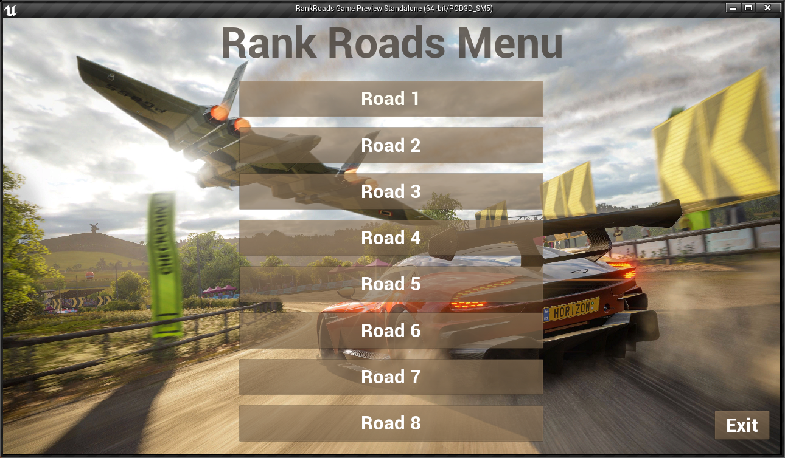

### Performance Predication Driving Simulator

#### Building from Source

Please follow the instructions on our [wiki](https://github.com/omarmagdy217/Driving-Behavior-Prediction_GP/wiki/Setting-Up-the-Driving-Performance-Simulator) for building all of the simulator dependencies and running the road maps on your machine.

---

#### Pre-built Binaries

Pre-built releases are available for download. Each release combines all of the rank different maps into a single executable with a main menu for selecting the desired road.

<div style="text-align:center"></div>

- All the releases are built for x64 Windows and can be found on our [releases](https://github.com/omarmagdy217/Driving-Behavior-Prediction_GP/releases) page.

#### API Car Control
Based on the perfromance and the mental state of the driver, necessary safety actions should be taken to limit the driver's control on the car.
The `control_car.py` uses the APIs provided by AirSim to present three different types of controls based on the driving behaviour:
1. **Focused:** Reset any previously taken actions.
2. **Unfocuded:** Limit the driving speed to 10.
3. **Drowsy:** Take full control of the car from the user and enable auto park then wait for 60 seconds.

The script communicates internally using msgpack-rpc protocol over TCP/IP with any running instance of the simulator. It should be called with one of the three driving states:
```
python control_car.py -s, --state {focused, unfocused, drowsy}
```

For multiple runs of the script, it's recommended to do so using Python `subprocess` module with each run in a separate subprocess. The reason for doing so is that the "Unfocused" state requires continuous monitoring of the speed of the car, that's why it should be kept running in the background. If the script is called in another process with the "Focused" state for example, this new run will terminate the old run in the background.
